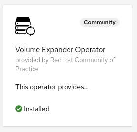

# Volume Expander Operator

The purpose of the volume-expander-operator is to expand volumes when they are running out of space.
This is achieved by using the [volume expansion feature](https://kubernetes.io/docs/concepts/storage/persistent-volumes/#expanding-persistent-volumes-claims).

The operator periodically checks the `kubelet_volume_stats_used_bytes` and `kubelet_volume_stats_capacity_bytes` published by the kubelets to decide when to expand a volume.
Notice that these metrics are generated only when a volume is mounted to a pod. Also the kubelet takes a minute or two to start generating accurate values for these metrics. The operator accounts for that.

This operator works based on the following annotations to PersistentVolumeClaim resources:

| Annotation | Default  | Description  |
| :-- | :-- | :-- |
| `volume-expander-operator.redhat-cop.io/autoexpand`  | N/A  | if set to "true" enables the volume-expander-operator to watch on this PVC  |
| `volume-expander-operator.redhat-cop.io/polling-frequency`  | `"30s"` | How frequently to poll the volume metrics. Express this value as a valid golang [Duration](https://golang.org/pkg/time/#ParseDuration)  |
| `volume-expander-operator.redhat-cop.io/expand-threshold-percent` | `"80"` | the percentage of used storage after which the volume will be expanded. This must be a positive integer. |
| `volume-expander-operator.redhat-cop.io/expand-by-percent` | `"25"` | the percentage by which the volume will be expanded, relative to the current size. This must be an integer between 0 and 100 |
| `volume-expander-operator.redhat-cop.io/expand-up-to` | MaxInt64 | the upper bound for this volume to be expanded to. The default value is the largest quantity representable and is intended to be interpreted as infinite. If the default is used it is recommend to ensure the namespace has a quota on the used storage class. |

Note that not all of the storage driver implementations support volume expansion. It is a responsibility of the user/platform administrator to ensure that storage class and the persistent volume claim meet all the requirements needed for the volume expansion feature to work properly.

This operator was tested with [OCS](https://www.redhat.com/en/technologies/cloud-computing/openshift-container-storage), but should work with any other storage driver that supports volume expansion.

## Deploying the Operator

This is a cluster-level operator that you can deploy in any namespace, `volume-expander-operator` is recommended.

It is recommended to deploy this operator via [`OperatorHub`](https://operatorhub.io/), but you can also deploy it using [`Helm`](https://helm.sh/).

### Multiarch Support

| Arch  | Support  |
|:-:|:-:|
| amd64  | ✅ |
| arm64  | ✅  |
| ppc64le  | ✅  |
| s390x  | ✅  |

### Deploying from OperatorHub

> **Note**: This operator supports being installed disconnected environments

If you want to utilize the Operator Lifecycle Manager (OLM) to install this operator, you can do so in two ways: from the UI or the CLI.

#### Deploying from OperatorHub UI

- If you would like to launch this operator from the UI, you'll need to navigate to the OperatorHub tab in the console.Before starting, make sure you've created the namespace that you want to install this operator to with the following:

```shell
oc new-project volume-expander-operator
```

- Once there, you can search for this operator by name: `volume expander operator`. This will then return an item for our operator and you can select it to get started. Once you've arrived here, you'll be presented with an option to install, which will begin the process.
- After clicking the install button, you can then select the namespace that you would like to install this to as well as the installation strategy you would like to proceed with (`Automatic` or `Manual`).
- Once you've made your selection, you can select `Subscribe` and the installation will begin. After a few moments you can go ahead and check your namespace and you should see the operator running.



#### Deploying from OperatorHub using CLI

If you'd like to launch this operator from the command line, you can use the manifests contained in this repository by running the following:

oc new-project volume-expander-operator

```shell
oc apply -f config/operatorhub -n volume-expander-operator
```

This will create the appropriate OperatorGroup and Subscription and will trigger OLM to launch the operator in the specified namespace.

### Deploying with Helm

Here are the instructions to install the latest release with Helm.

```shell
oc new-project volume-expander-operator
helm repo add volume-expander-operator https://redhat-cop.github.io/volume-expander-operator
helm repo update
helm install volume-expander-operator volume-expander-operator/volume-expander-operator
```

This can later be updated with the following commands:

```shell
helm repo update
helm upgrade volume-expander-operator volume-expander-operator/volume-expander-operator
```

## Metrics

Prometheus compatible metrics are exposed by the Operator and can be integrated into OpenShift's default cluster monitoring. To enable OpenShift cluster monitoring, label the namespace the operator is deployed in with the label `openshift.io/cluster-monitoring="true"`.

```shell
oc label namespace <namespace> openshift.io/cluster-monitoring="true"
```

### Testing metrics

```sh
export operatorNamespace=volume-expander-operator-local # or volume-expander-operator
oc label namespace ${operatorNamespace} openshift.io/cluster-monitoring="true"
oc rsh -n openshift-monitoring -c prometheus prometheus-k8s-0 /bin/bash
export operatorNamespace=volume-expander-operator-local # or volume-expander-operator
curl -v -s -k -H "Authorization: Bearer $(cat /var/run/secrets/kubernetes.io/serviceaccount/token)" https://volume-expander-operator-controller-manager-metrics.${operatorNamespace}.svc.cluster.local:8443/metrics
exit
```

## Development

### Running the operator locally

```shell
export repo=raffaelespazzoli
docker login quay.io/$repo
oc new-project volume-expander-operator
oc project volume-expander-operator
tilt up
```

### Test helm chart locally

Define an image and tag. For example...

```shell
export imageRepository="quay.io/redhat-cop/volume-expander-operator"
export imageTag="$(git -c 'versionsort.suffix=-' ls-remote --exit-code --refs --sort='version:refname' --tags https://github.com/redhat-cop/volume-expander-operator.git '*.*.*' | tail --lines=1 | cut --delimiter='/' --fields=3)"
```

Deploy chart...

```shell
make helmchart IMG=${imageRepository} VERSION=${imageTag}
helm upgrade -i volume-expander-operator-local charts/volume-expander-operator -n volume-expander-operator-local --create-namespace
```

Delete...

```shell
helm delete volume-expander-operator-local -n volume-expander-operator-local
```

### Building/Pushing the operator image

```shell
export repo=raffaelespazzoli #replace with yours
docker login quay.io/$repo
make docker-build IMG=quay.io/$repo/volume-expander-operator:latest
make docker-push IMG=quay.io/$repo/volume-expander-operator:latest
```

### Deploy to OLM via bundle

```shell
make manifests
make bundle IMG=quay.io/$repo/volume-expander-operator:latest
operator-sdk bundle validate ./bundle --select-optional name=operatorhub
make bundle-build BUNDLE_IMG=quay.io/$repo/volume-expander-operator-controller-bundle:latest
docker push quay.io/$repo/volume-expander-operator-controller-bundle:latest
operator-sdk bundle validate quay.io/$repo/volume-expander-operator-controller-bundle:latest --select-optional name=operatorhub
oc new-project volume-expander-operator
oc label namespace volume-expander-operator openshift.io/cluster-monitoring="true"
operator-sdk cleanup volume-expander-operator -n volume-expander-operator
operator-sdk run bundle --install-mode AllNamespaces -n volume-expander-operator quay.io/$repo/volume-expander-operator-controller-bundle:latest
```

### Testing

#### Manual tests

```shell
oc new-project volume-expander-operator-test
oc apply -f ./test/volume.yaml -n volume-expander-operator-test
oc apply -f ./test/deployment.yaml -n volume-expander-operator-test
```

## Releasing

```shell
git tag -a "<tagname>" -m "<commit message>"
git push upstream <tagname>
```

If you need to remove a release:

```shell
git tag -d <tagname>
git push upstream --delete <tagname>
```

If you need to "move" a release to the current main

```shell
git tag -f <tagname>
git push upstream -f <tagname>
```

### Cleaning up

```shell
operator-sdk cleanup volume-expander-operator -n volume-expander-operator
oc delete operatorgroup operator-sdk-og
oc delete catalogsource volume-expander-operator-catalog
```
